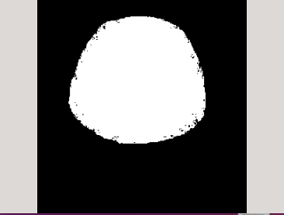
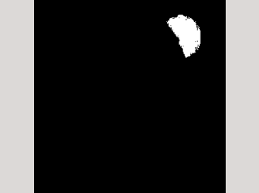
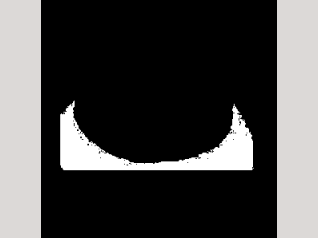
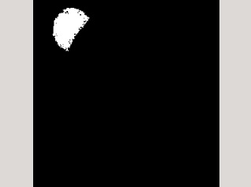

# multi_seed_region_grow
A multi-seed region growing algorithm. It can be used as a preprocess in object-recognition, segmentation, tracker and so on.

## Environment
* GCC
* CMake
* Opencv 2

## Effect
* source image

* result

## TODO
 * use more powerful estimating algorithm, instead of "delta and threshold"
 * optimize for rgb image
 * ptimize the efficiency
 
------
 For more detail, see: https://imlogm.github.io/%E5%9B%BE%E5%83%8F%E5%A4%84%E7%90%86/multi-seed-region-grow/
