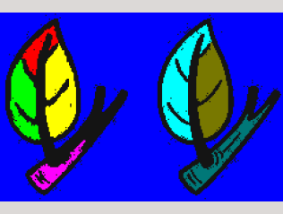

# multi_seed_region_grow
A multi-seed region growing algorithm. It can be used as a preprocess in object-recognition, segmentation, tracker and so on.

It's not easy to find multi-seed region growing algorithm written in C++ and opencv 2+, so I share this simple version.

## Environment
* GCC
* CMake
* Opencv 2

## Effect
* source image

* result

## TODO
 * use more powerful estimating algorithm, instead of "delta and threshold"
 * optimize for rgb image (**achieved now**)
 * optimize the efficiency

 ## Attention
 You need to change "OpenCV_DIR", "OpenCV_LIB_DIR", "OpenCV_INCLUDE_DIRS" in "CMakeList.txt".

 A fixed threshold is not always effective.

 ## About "auto-threshold"

"fixed-threshold" is not elegant :)

 I have written an algorithm to show how to make program find best threshold automatically. 
 
 It's an extension program. In order to run this program, you need add cpp file "auto_threshold_demo.cpp" to "CMakeLists.txt".

 Remember the demo is just one of the ways to "auto-threshold" and it not guarantee for all image. You may find more perfect algorithm.

 For more algorithm details, see: https://imlogm.github.io/%E5%9B%BE%E5%83%8F%E5%A4%84%E7%90%86/multi-seed-region-grow/

 * source image

* result

